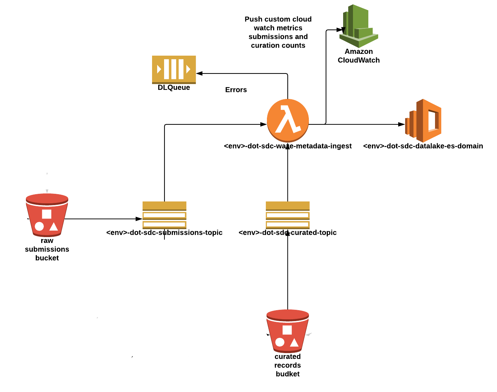

[](https://travis-ci.com/usdot-jpo-sdc/sdc-dot-metadata-ingest)
[](https://sonarcloud.io/dashboard?id=usdot-jpo-sdc_sdc-dot-metadata-ingest)
[](https://sonarcloud.io/dashboard?id=usdot-jpo-sdc_sdc-dot-metadata-ingest)

# sdc-dot-metadata-ingest

This is a lambda function developed by SDC Team for generating the metadata from an s3 key and indexing into Elasticsearch Service.

There are two primary functions serves the need for two different lambda functions:
* **bucket-handler-lambda** - generates the metadata and indexes into Elasticsearch
* **register-kibana-dashboards** - generates the default datalake visualization dashboards

The Secure Data Commons (SDC) is a cloud-based analytics platform that enables access to traffic engineers, researchers, and data scientists to various transportation related datasets. The SDC platform is a prototype created as part of the U.S. Department of Transportation (USDOT) research project.  The objective of this prototype is to provide a secure platform, which will enable USDOT and the broader transportation sector to share and collaborate their research, tools, algorithms, analysis, and more around sensitive datasets using modern, commercially available tools without the need to install tools or software locally.  Secure Data Commons (SDC) enables collaborative but controlled integration and analysis of research data at the moderate sensitivity level (PII & CBI).


<!---                           -->
<!---     Table of Contents     -->
<!---                           -->
## Table of Contents

[I. Release Notes](#release-notes)

[II. Usage Example](#usage-example)

[III. Configuration](#configuration)

[IV. Installation](#installation)

[V. Design and Architecture](#design-architecture)

[VI. Unit Tests](#unit-tests)

[VII.  File Manifest](#file-manifest)

[VIII.  Development Setup](#development-setup)

[IX.  Release History](#release-history)

[X. Contact Information](#contact-information)

[XI. Contributing](#contributing)

[XII. Known Bugs](#known-bugs)

[XIII. Credits and Acknowledgment](#credits-and-acknowledgement)

[XIV.  CODE.GOV Registration Info](#code-gov-registration-info)


<!---                           -->
<!---     Release Notes         -->
<!---                           -->

<a name="release-notes"/>

## I. Release Notes


<!---                           -->
<!---     Usage Example         -->
<!---                           -->

<a name="usage-example"/>

## II. Usage Example


<!---                           -->
<!---     Configuration         -->
<!---                           -->

<a name="configuration"/>

## III. Configuration


<!---                           -->
<!---     Installation          -->
<!---                           -->

<a name="installation"/>

## IV. Installation

The following instructions describe the procedure to build and deploy the lambda.

### Build and Deploy the Lambda

#### Environment Variables
Below are the environment variable needed :- 

CURATED_BUCKET_NAME - {name_of_the_curate_bucket}

CV_SUBMISSIONS_COUNTS_METRIC  - {metrics_name_of_cv_submission}

ELASTICSEARCH_ENDPOINT  - {url_of_elatic_search}

ENVIRONMENT_NAME        -{dev/preprod/prod}

PUBLISHED_BUCKET_NAME   -{name_of_the_published_bucket}

SUBMISSIONS_BUCKET_NAME - {name_of_the_raw_submission_bucket}

WAZE_CURATED_COUNTS_METRIC - {metrics_name_of_curated}

WAZE_SUBMISSIONS_COUNT_METRIC -{metrics_name_of_raw_submission}

WAZE_ZERO_BYTE_SUBMISSIONS_COUNT_METRIC - {metrics_name_of_zero_byte}


<!---                                 -->
<!---     Design and Architecture     -->
<!---                                 -->

<a name="design-architecture"/>

## V. Design and Architecture


This lamda function is triggered by aws-s3-notification whenever an object is put into raw submission bucket or curated bucket.The primary function of this lambda is given below.

**1.** It creates metadata of the new object and push metadata to elastic search.

**2.** It also push custom metrics for raw submission count,zero byte and curated count to cloud watch metrics.

**3.** It also creates visualization metrics in kibana.

**4.** In case of any failures/errors it push messages in DLQ so that this can be processed later.

<a name="design-diagram"/>

### Design Diagram




<!---                           -->
<!---     Unit Tests          -->
<!---                           -->

<a name="unit-tests"/>

## VI. Unit Tests


<!---                           -->
<!---     File Manifest         -->
<!---                           -->

<a name="file-manifest"/>

## VII. File Manifest


<!---                           -->
<!---     Development Setup     -->
<!---                           -->

<a name="development-setup"/>

## VIII. Development Setup

### Prerequisites
*Python 3.6

### Build Process

**Step 1**: Setup virtual environment on your system by following below link:

https://docs.aws.amazon.com/lambda/latest/dg/with-s3-example-deployment-pkg.html#with-s3-example-deployment-pkg-python

**Step 2**: Crete a script file with below contents for e.g(sdc-dot-waze-data-ingest.sh)
```#!/bin/sh

cd {path_to_your_repository}/sdc-dot-metadata-ingest
zipFileName="{path_to_your_repository}/sdc-dot-metadata-ingest.zip"

echo "Zip file name is = ${zipFileName}"

zip -9 $zipFileName lambdas/*
zip -r9 $zipFileName common/*
zip -r9 $zipFileName dashboard_registry_handler_main.py.py
zip -r9 $zipFileName bucket_event_handler_main.py

cd {path_to_your_virtual_env}/python3.6/site-packages/
zip -r9 $zipFileName chardet certifi idna
```

**Step 3**: Change the permission of the script file

```
chmod u+x sdc-dot-waze-data-ingest.sh
```

**Step 4** Run the script file
./sdc-dot-metadata-ingest.sh

**Step 5**: Upload the sdc-dot-metadata-ingest.zip generated from Step 4 to a lambda function via aws console.


<!---                           -->
<!---     Release History       -->
<!---                           -->

<a name="release-history"/>

## IX. Release History


<!---                             -->
<!---     Contact Information     -->
<!---                             -->

<a name="contact-information"/>

## X. Contact Information

<!-- Your Name – @YourTwitter – YourEmail@example.com
Distributed under the XYZ license. See LICENSE for more information.
https://github.com/yourname/github-link -->

For any queries you can reach to support@securedatacommons.com


<!---                           -->
<!---     Contributing          -->
<!---                           -->

<a name="contributing"/>

## XI. Contributing


<!---                           -->
<!---     Known Bugs            -->
<!---                           -->

<a name="known-bugs"/>

## XII. Known Bugs


<!---                                    -->
<!---     Credits and Acknowledgment     -->
<!---                                    -->

<a name="credits-and-acknowledgement"/>

## XIII. Credits and Acknowledgment
Thank you to the Department of Transportation for funding to develop this project.


<!---                                    -->
<!---     CODE.GOV Registration Info     -->
<!---                                    -->

<a name="code-gov-registration-info">

## XIV. CODE.GOV Registration Info
Agency:  DOT

Short Description: This is a lambda function developed by SDC Team for generating the metadata from an s3 key and indexing into Elasticsearch Service.

Status: Beta

Tags: transportation, connected vehicles, intelligent transportation systems

Labor Hours:

Contact Name: support@securedatacommons.com

<!-- Contact Phone: -->

